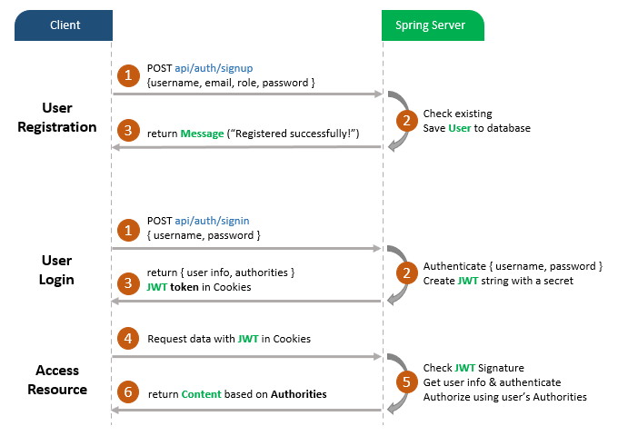
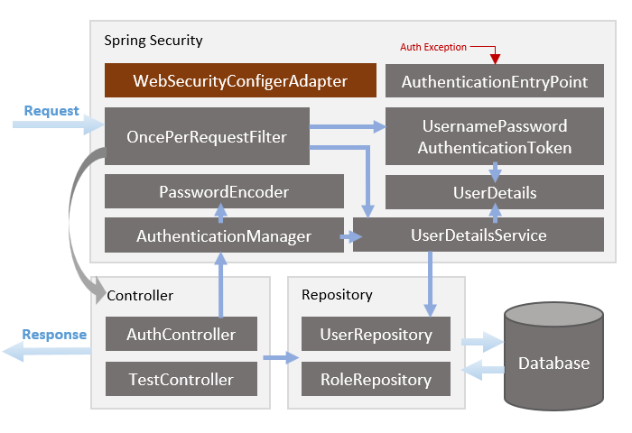

##Overview of Spring Boot Refresh Token with JWT example
We already have a Spring Boot application in that:
•	User can sign up new account, or login with username & password.
•	By User’s role (admin, moderator, user), we authorize the User to access resources
With APIs:
Methods	Urls	Actions
POST	/api/auth/signup	signup new account
POST	/api/auth/signin	login an account
GET	/api/users/all	retrieve public content
GET	/api/users/user	access User’s content
GET	/api/users/mod	access Moderator’s content
GET	/api/users/admin	access Admin’s content
The database we will use is MySQL by configuring project dependency & datasource.
Flow of Spring Boot Login and Registration example

The diagram shows flow of how we implement User Registration, User Login and Authorization process.
 
A JWT Token must be stored in Cookies if Client accesses protected resources.
Spring Boot Rest API Server Architecture with Spring Security
 
 Now I will explain it briefly.
Spring Security
– WebSecurityConfigurerAdapter is the crux of our security implementation. It provides HttpSecurity configurations to configure cors, csrf, session management, rules for protected resources. We can also extend and customize the default configuration that contains the elements below.
– UserDetailsService interface has a method to load User by username and returns a UserDetails object that Spring Security can use for authentication and validation.
– UserDetails contains necessary information (such as: username, password, authorities) to build an Authentication object.
– UsernamePasswordAuthenticationToken gets {username, password} from login Request, AuthenticationManager will use it to authenticate a login account.
– AuthenticationManager has a DaoAuthenticationProvider (with help of UserDetailsService & PasswordEncoder) to validate UsernamePasswordAuthenticationToken object. If successful, AuthenticationManager returns a fully populated Authentication object (including granted authorities).
– OncePerRequestFilter makes a single execution for each request to our API. It provides a doFilterInternal () method that we will implement parsing & validating JWT, loading User details (using UserDetailsService), checking Authorization (using UsernamePasswordAuthenticationToken).
– AuthenticationEntryPoint will catch authentication error.
Repository contains UserRepository & RoleRepository to work with Database, will be imported into Controller.
Controller receives and handles request after it was filtered by OncePerRequestFilter.
– AuthController handles signup/login requests
– UsersController has accessing protected resource methods with role based validations.
Understand the architecture deeply and grasp the overview easier:

Technology
•	Java 8
•	Spring Boot 2.6.1 (with Spring Security, Spring Web, Spring Data JPA)
•	jjwt 0.9.1
•	MySQL
•	Maven 3.6.1
Project Structure
This is folders & files structure for our Spring Boot Login example:
 

Security: we configure Spring Security & implement Security Objects here.
•	WebSecurityConfig extends WebSecurityConfigurerAdapter
•	UserDetailsServiceImpl implements UserDetailsService
•	UserDetailsImpl implements UserDetails
•	AuthEntryPointJwt implements AuthenticationEntryPoint
•	AuthTokenFilter extends OncePerRequestFilter
•	JwtUtils provides methods for generating, parsing, validating JWT
Controllers handle signup/login requests & authorized requests.
•	AuthController: @PostMapping(‘/signup’), @PostMapping(‘/signin’), @PostMapping(‘/logout’)
•	UsersController: @GetMapping(‘/api/users/all’), @GetMapping(‘/api/ users /[role]’)
Repository has interfaces that extend Spring Data JPA JpaRepository to interact with Database.
•	UserRepository extends JpaRepository<User, Long>
•	RoleRepository extends JpaRepository<Role, Long>
Models define two main models for Authentication (User) & Authorization (Role). They have many-to-many relationship.
•	User: id, username, email, password, roles
•	Role: id, name
Payload defines classes for Request and Response objects
We also have application.properties for configuring Spring Data source, Spring Data JPA and App properties (such as JWT Secret string or Token expiration time).
Setup new Spring Boot Login project
Use Spring web tool or your development tool (Spring Tool Suite, Eclipse, Intellij) to create a Spring Boot project.
Then open pom.xml and add these dependencies:
<dependency>
	<groupId>org.springframework.boot</groupId>
	<artifactId>spring-boot-starter-data-jpa</artifactId>
</dependency>
<dependency>
	<groupId>org.springframework.boot</groupId>
	<artifactId>spring-boot-starter-security</artifactId>
</dependency>
<dependency>
	<groupId>org.springframework.boot</groupId>
	<artifactId>spring-boot-starter-validation</artifactId>
</dependency>
<dependency>
	<groupId>org.springframework.boot</groupId>
	<artifactId>spring-boot-starter-web</artifactId>
</dependency>
<dependency>
	<groupId>io.jsonwebtoken</groupId>
	<artifactId>jjwt</artifactId>
	<version>0.9.1</version>
</dependency>
<dependency>
	<groupId>mysql</groupId>
	<artifactId>mysql-connector-java</artifactId>
	<scope>runtime</scope>
</dependency>
Configure Spring Data source, JPA, App properties
Under src/main/resources folder, open application.properties, add some new lines.
spring.datasource.url= jdbc:mysql://localhost:3306/testdb?useSSL=false
spring.datasource.username= root
spring.datasource.password= 123456
spring.jpa.properties.hibernate.dialect= org.hibernate.dialect.MySQL5InnoDBDialect
spring.jpa.hibernate.ddl-auto= update
# App Properties
expcoder.app.jwtCookieName= expcoder
expcoder.app.jwtSecret= expCoderSecretKey
expcoder.app.jwtExpirationMs= 86400000
•	spring.datasource.username & spring.datasource.password properties are the same as your database installation.
•	Spring Boot uses Hibernate for JPA implementation, we configure MySQL5InnoDBDialect for MySQL database
•	spring.jpa.hibernate.ddl-auto is used for database initialization. We set the value to update value so that a table will be created in the database automatically corresponding to defined data model. Any change to the model will also trigger an update to the table. For production, this property should be validating.
Create the models
There are 3 tables in database: users, roles and user_roles for many-to-many relationship.
Let’s define these models.
In models package, create 3 files:
ERole enum in ERole.java.
In this example, we have 3 roles corresponding to 3 enum.

package com.amica.springbootlogin.models;
public enum ERole {
  ROLE_USER,
  ROLE_MODERATOR,
  ROLE_ADMIN
}
Role model in Role.java
package com.amica.springbootlogin.models;
import javax.persistence.*;
@Entity
@Table(name = "roles")
public class Role {
  @Id
  @GeneratedValue(strategy = GenerationType.IDENTITY)
  private Integer id;
  @Enumerated(EnumType.STRING)
  @Column(length = 20)
  private ERole name;
  public Role() {
  }
  public Role(ERole name) {
    this.name = name;
  }
  public Integer getId() {
    return id;
  }
  public void setId(Integer id) {
    this.id = id;
  }
  public ERole getName() {
    return name;
  }
  public void setName(ERole name) {
    this.name = name;
  }
}

User model in User.java.
It has 5 fields: id, username, email, password, roles.
package com.amica.springbootlogin.models;
import java.util.HashSet;
import java.util.Set;
import javax.persistence.*;
import javax.validation.constraints.Email;
import javax.validation.constraints.NotBlank;
import javax.validation.constraints.Size;
@Entity
@Table(name = "users",
       uniqueConstraints = {
           @UniqueConstraint(columnNames = "username"),
           @UniqueConstraint(columnNames = "email")
       })
public class User {
  @Id
  @GeneratedValue(strategy = GenerationType.IDENTITY)
  private Long id;
  @NotBlank
  @Size(max = 20)
  private String username;
  @NotBlank
  @Size(max = 50)
  @Email
  private String email;
  @NotBlank
  @Size(max = 120)
  private String password;
  @ManyToMany(fetch = FetchType.LAZY)
  @JoinTable(name = "user_roles", 
             joinColumns = @JoinColumn(name = "user_id"),
             inverseJoinColumns = @JoinColumn(name = "role_id"))
  private Set<Role> roles = new HashSet<>();
  public User() {
  }
  public User(String username, String email, String password) {
    this.username = username;
    this.email = email;
    this.password = password;
  }
  public Long getId() {
    return id;
  }
  public void setId(Long id) {
    this.id = id;
  }
  public String getUsername() {
    return username;
  }
  public void setUsername(String username) {
    this.username = username;
  }
  public String getEmail() {
    return email;
  }
  public void setEmail(String email) {
    this.email = email;
  }
  public String getPassword() {
    return password;
  }
  public void setPassword(String password) {
    this.password = password;
  }
  public Set<Role> getRoles() {
    return roles;
  }
  public void setRoles(Set<Role> roles) {
    this.roles = roles;
  }
}

Implement Repositories
Now, each model above needs a repository for persisting and accessing data. In repository package, let’s create 2 repositories.
UserRepository
There are 3 necessary methods that JpaRepository supports.
package com.amica.springbootlogin.repository;
import java.util.Optional;
import org.springframework.data.jpa.repository.JpaRepository;
import org.springframework.stereotype.Repository;
import com.amica.springbootlogin.models.User;
@Repository
public interface UserRepository extends JpaRepository<User, Long> {
  Optional<User> findByUsername(String username);
  Boolean existsByUsername(String username);
  Boolean existsByEmail(String email);
}
RoleRepository
This repository also extends JpaRepository and provides a finder method.
package com.amica.springbootlogin.repository;
import java.util.Optional;
import org.springframework.data.jpa.repository.JpaRepository;
import org.springframework.stereotype.Repository;
import com.amica.springbootlogin.models.ERole;
import com.amica.springbootlogin.models.Role;
@Repository
public interface RoleRepository extends JpaRepository<Role, Long> {
  Optional<Role> findByName(ERole name);
}
Configure Spring Security
In security package, create WebSecurityConfig class that extends WebSecurityConfigurerAdapter.
WebSecurityConfig.java
package com.amica.springbootlogin.security;
import org.springframework.beans.factory.annotation.Autowired;
import org.springframework.context.annotation.Bean;
import org.springframework.context.annotation.Configuration;
import org.springframework.security.authentication.AuthenticationManager;
import org.springframework.security.config.annotation.authentication.builders.AuthenticationManagerBuilder;
import org.springframework.security.config.annotation.method.configuration.EnableGlobalMethodSecurity;
import org.springframework.security.config.annotation.web.builders.HttpSecurity;
import org.springframework.security.config.annotation.web.configuration.EnableWebSecurity;
import org.springframework.security.config.annotation.web.configuration.WebSecurityConfigurerAdapter;
import org.springframework.security.config.http.SessionCreationPolicy;
import org.springframework.security.crypto.bcrypt.BCryptPasswordEncoder;
import org.springframework.security.crypto.password.PasswordEncoder;
import org.springframework.security.web.authentication.UsernamePasswordAuthenticationFilter;
import com.amica.springbootlogin.security.jwt.AuthEntryPointJwt;
import com.amica.springbootlogin.security.jwt.AuthTokenFilter;
import com.amica.springbootlogin.security.services.UserDetailsServiceImpl;
@Configuration
@EnableWebSecurity
@EnableGlobalMethodSecurity(
    // securedEnabled = true,
    // jsr250Enabled = true,
    prePostEnabled = true)
public class WebSecurityConfig extends WebSecurityConfigurerAdapter {
  @Autowired
  UserDetailsServiceImpl userDetailsService;
  @Autowired
  private AuthEntryPointJwt unauthorizedHandler;
  @Bean
  public AuthTokenFilter authenticationJwtTokenFilter() {
    return new AuthTokenFilter();
  }
  @Override
  public void configure(AuthenticationManagerBuilder authenticationManagerBuilder) throws Exception {
    authenticationManagerBuilder.userDetailsService(userDetailsService).passwordEncoder(passwordEncoder());
  }
  @Bean
  @Override
  public AuthenticationManager authenticationManagerBean() throws Exception {
    return super.authenticationManagerBean();
  }
  @Bean
  public PasswordEncoder passwordEncoder() {
    return new BCryptPasswordEncoder();
  }
  @Override
  protected void configure(HttpSecurity http) throws Exception {
    http.cors().and().csrf().disable()
      .exceptionHandling().authenticationEntryPoint(unauthorizedHandler).and()
      .sessionManagement().sessionCreationPolicy(SessionCreationPolicy.STATELESS).and()
      .authorizeRequests().antMatchers("/api/auth/**").permitAll()
      .antMatchers("/api/test/**").permitAll()
      .anyRequest().authenticated();
    http.addFilterBefore(authenticationJwtTokenFilter(), UsernamePasswordAuthenticationFilter.class);
  }
}

Let me explain the code above.
– @EnableWebSecurity allows spring to find and automatically apply the class to the global Web Security.
– @EnableGlobalMethodSecurity provides AOP security on methods. It enables @PreAuthorize, @PostAuthorize, it also supports JSR-250. You can find more parameters in configuration in Method Security Expressions.
– We override the configure (HttpSecurity http) method from WebSecurityConfigurerAdapter interface. It tells Spring Security how we configure CORS and CSRF, when we want to require all users to be authenticated or not, which filter (AuthTokenFilter) and when we want it to work (filter before UsernamePasswordAuthenticationFilter), which Exception Handler is chosen (AuthEntryPointJwt).
– Spring Security will load User details to perform authentication & authorization. So it has UserDetailsService interface that we need to implement.
– The implementation of UserDetailsService will be used for configuring DaoAuthenticationProvider by AuthenticationManagerBuilder.userDetailsService() method.
– We also need a PasswordEncoder for the DaoAuthenticationProvider. If we don’t specify, it will use plain text.

Implement UserDetails & UserDetailsService
If the authentication process is successful, we can get User’s information such as username, password, authorities from an Authentication object.
Authentication authentication = 
        authenticationManager.authenticate(
            new UsernamePasswordAuthenticationToken(username, password)
        );
UserDetails userDetails = (UserDetails) authentication.getPrincipal();
// userDetails.getUsername()
// userDetails.getPassword()
// userDetails.getAuthorities()
If we want to get more data (id, email…), we can create an implementation of this UserDetails interface.
security/services/UserDetailsImpl.java
package com.amica.springbootlogin.security.services;
import java.util.Collection;
import java.util.List;
import java.util.Objects;
import java.util.stream.Collectors;
import org.springframework.security.core.GrantedAuthority;
import org.springframework.security.core.authority.SimpleGrantedAuthority;
import org.springframework.security.core.userdetails.UserDetails;
import com.amica springbootlogin.models.User;
import com.fasterxml.jackson.annotation.JsonIgnore;
public class UserDetailsImpl implements UserDetails {
  private static final long serialVersionUID = 1L;
  private Long id;
  private String username;
  private String email;
  @JsonIgnore
  private String password;
  private Collection<? extends GrantedAuthority> authorities;
  public UserDetailsImpl(Long id, String username, String email, String password,
      Collection<? extends GrantedAuthority> authorities) {
    this.id = id;
    this.username = username;
    this.email = email;
    this.password = password;
    this.authorities = authorities;
  }
  public static UserDetailsImpl build(User user) {
    List<GrantedAuthority> authorities = user.getRoles().stream()
        .map(role -> new SimpleGrantedAuthority(role.getName().name()))
        .collect(Collectors.toList());
    return new UserDetailsImpl(
        user.getId(), 
        user.getUsername(), 
        user.getEmail(),
        user.getPassword(), 
        authorities);
  }
  @Override
  public Collection<? extends GrantedAuthority> getAuthorities() {
    return authorities;
  }
  public Long getId() {
    return id;
  }
  public String getEmail() {
    return email;
  }
  @Override
  public String getPassword() {
    return password;
  }
  @Override
  public String getUsername() {
    return username;
  }
  @Override
  public boolean isAccountNonExpired() {
    return true;
  }
  @Override
  public boolean isAccountNonLocked() {
    return true;
  }
  @Override
  public boolean isCredentialsNonExpired() {
    return true;
  }
  @Override
  public boolean isEnabled() {
    return true;
  }
  @Override
  public boolean equals(Object o) {
    if (this == o)
      return true;
    if (o == null || getClass() != o.getClass())
      return false;
    UserDetailsImpl user = (UserDetailsImpl) o;
    return Objects.equals(id, user.id);
  }
}
Look at the code above, you can notice that we convert Set<Role> into List<GrantedAuthority>. It is important to work with Spring Security and Authentication object later.
As I have said before, we need UserDetailsService for getting UserDetails object. You can look at UserDetailsService interface that has only one method:
public interface UserDetailsService {
  UserDetails loadUserByUsername(String username) throws UsernameNotFoundException;
}

So we implement it and override loadUserByUsername() method.
security/services/UserDetailsServiceImpl.java
package com.amica.springbootlogin.security.services;
import org.springframework.beans.factory.annotation.Autowired;
import org.springframework.security.core.userdetails.UserDetails;
import org.springframework.security.core.userdetails.UserDetailsService;
import org.springframework.security.core.userdetails.UsernameNotFoundException;
import org.springframework.stereotype.Service;
import org.springframework.transaction.annotation.Transactional;
import com.amica springbootlogin.models.User;
import com.amica.springbootlogin.repository.UserRepository;
@Service
public class UserDetailsServiceImpl implements UserDetailsService {
  @Autowired
  UserRepository userRepository;
  @Override
  @Transactional
  public UserDetails loadUserByUsername(String username) throws UsernameNotFoundException {
    User user = userRepository.findByUsername(username)
        .orElseThrow(() -> new UsernameNotFoundException("User Not Found with username: " + username));
    return UserDetailsImpl.build(user);
  }
}

In the code above, we get full custom User object using UserRepository, then we build a UserDetails object using static build() method.

##Filter the Requests
Let’s define a filter that executes once per request. So we create AuthTokenFilter class that extends OncePerRequestFilter and override doFilterInternal() method.
security/jwt/AuthTokenFilter.java

package com.amica.springbootlogin.security.jwt;
import java.io.IOException;
import javax.servlet.FilterChain;
import javax.servlet.ServletException;
import javax.servlet.http.HttpServletRequest;
import javax.servlet.http.HttpServletResponse;
import org.slf4j.Logger;
import org.slf4j.LoggerFactory;
import org.springframework.beans.factory.annotation.Autowired;
import org.springframework.security.authentication.UsernamePasswordAuthenticationToken;
import org.springframework.security.core.context.SecurityContextHolder;
import org.springframework.security.core.userdetails.UserDetails;
import org.springframework.security.web.authentication.WebAuthenticationDetailsSource;
import org.springframework.web.filter.OncePerRequestFilter;
import com.amica.springbootlogin.security.services.UserDetailsServiceImpl;
public class AuthTokenFilter extends OncePerRequestFilter {
  @Autowired
  private JwtUtils jwtUtils;
  @Autowired
  private UserDetailsServiceImpl userDetailsService;
  private static final Logger logger = LoggerFactory.getLogger(AuthTokenFilter.class);
  @Override
  protected void doFilterInternal(HttpServletRequest request, HttpServletResponse response, FilterChain filterChain)
      throws ServletException, IOException {
    try {
      String jwt = parseJwt(request);
      if (jwt != null && jwtUtils.validateJwtToken(jwt)) {
        String username = jwtUtils.getUserNameFromJwtToken(jwt);
        UserDetails userDetails = userDetailsService.loadUserByUsername(username);
        
        UsernamePasswordAuthenticationToken authentication = 
            new UsernamePasswordAuthenticationToken(userDetails,
                                                    null,
                                                    userDetails.getAuthorities());
        
        authentication.setDetails(new WebAuthenticationDetailsSource().buildDetails(request));
        SecurityContextHolder.getContext().setAuthentication(authentication);
      }
    } catch (Exception e) {
      logger.error("Cannot set user authentication: {}", e);
    }
    filterChain.doFilter(request, response);
  }
  private String parseJwt(HttpServletRequest request) {
    String jwt = jwtUtils.getJwtFromCookies(request);
    return jwt;
  }
}

What we do inside doFilterInternal():
– get JWT from the HTTP Cookies
– if the request has JWT, validate it, parse username from it
– from username, get UserDetails to create an Authentication object
– set the current UserDetails in SecurityContext using setAuthentication(authentication) method.

After this, everytime you want to get UserDetails, just use SecurityContext like this:

UserDetails userDetails =
	(UserDetails) SecurityContextHolder.getContext().getAuthentication().getPrincipal();
// userDetails.getUsername()
// userDetails.getPassword()
// userDetails.getAuthorities()

#Create JWT Utility class
This class has 3 main funtions:

getJwtFromCookies: get JWT from Cookies by Cookie name
generateJwtCookie: generate a Cookie containing JWT from username, date, expiration, secret
getCleanJwtCookie: return Cookie with null value (used for clean Cookie)
getUserNameFromJwtToken: get username from JWT
validateJwtToken: validate a JWT with a secret
security/jwt/JwtUtils.java

package com.amica.springbootlogin.security.jwt;
import java.util.Date;
import javax.servlet.http.Cookie;
import javax.servlet.http.HttpServletRequest;
import org.slf4j.Logger;
import org.slf4j.LoggerFactory;
import org.springframework.beans.factory.annotation.Value;
import org.springframework.http.ResponseCookie;
import org.springframework.stereotype.Component;
import org.springframework.web.util.WebUtils;
import com.amica.springbootlogin.security.services.UserDetailsImpl;
import io.jsonwebtoken.*;
@Component
public class JwtUtils {
  private static final Logger logger = LoggerFactory.getLogger(JwtUtils.class);
  @Value("${amica.app.jwtSecret}")
  private String jwtSecret;
  @Value("${amica.app.jwtExpirationMs}")
  private int jwtExpirationMs;
  @Value("${amica.app.jwtCookieName}")
  private String jwtCookie;
  public String getJwtFromCookies(HttpServletRequest request) {
    Cookie cookie = WebUtils.getCookie(request, jwtCookie);
    if (cookie != null) {
      return cookie.getValue();
    } else {
      return null;
    }
  }
  public ResponseCookie generateJwtCookie(UserDetailsImpl userPrincipal) {
    String jwt = generateTokenFromUsername(userPrincipal.getUsername());
    ResponseCookie cookie = ResponseCookie.from(jwtCookie, jwt).path("/api").maxAge(24 * 60 * 60).httpOnly(true).build();
    return cookie;
  }
  public ResponseCookie getCleanJwtCookie() {
    ResponseCookie cookie = ResponseCookie.from(jwtCookie, null).path("/api").build();
    return cookie;
  }
  public String getUserNameFromJwtToken(String token) {
    return Jwts.parser().setSigningKey(jwtSecret).parseClaimsJws(token).getBody().getSubject();
  }
  public boolean validateJwtToken(String authToken) {
    try {
      Jwts.parser().setSigningKey(jwtSecret).parseClaimsJws(authToken);
      return true;
    } catch (SignatureException e) {
      logger.error("Invalid JWT signature: {}", e.getMessage());
    } catch (MalformedJwtException e) {
      logger.error("Invalid JWT token: {}", e.getMessage());
    } catch (ExpiredJwtException e) {
      logger.error("JWT token is expired: {}", e.getMessage());
    } catch (UnsupportedJwtException e) {
      logger.error("JWT token is unsupported: {}", e.getMessage());
    } catch (IllegalArgumentException e) {
      logger.error("JWT claims string is empty: {}", e.getMessage());
    }
    return false;
  }
  
  public String generateTokenFromUsername(String username) {
    return Jwts.builder()
        .setSubject(username)
        .setIssuedAt(new Date())
        .setExpiration(new Date((new Date()).getTime() + jwtExpirationMs))
        .signWith(SignatureAlgorithm.HS512, jwtSecret)
        .compact();
  }
}

Remember that we’ve added amica.app.jwtSecret, amica.app.jwtExpirationMs and amica.app.jwtCookieName properties in application.properties file.

#Handle Authentication Exception
Now we create AuthEntryPointJwt class that implements AuthenticationEntryPoint interface. Then we override the commence() method. This method will be triggerd anytime unauthenticated User requests a secured HTTP resource and an AuthenticationException is thrown.

security/jwt/AuthEntryPointJwt.java

package com.amica.springbootlogin.security.jwt;
import java.io.IOException;
import java.util.HashMap;
import java.util.Map;
import javax.servlet.ServletException;
import javax.servlet.http.HttpServletRequest;
import javax.servlet.http.HttpServletResponse;
import org.slf4j.Logger;
import org.slf4j.LoggerFactory;
import org.springframework.http.MediaType;
import org.springframework.security.core.AuthenticationException;
import org.springframework.security.web.AuthenticationEntryPoint;
import org.springframework.stereotype.Component;
import com.fasterxml.jackson.databind.ObjectMapper;
@Component
public class AuthEntryPointJwt implements AuthenticationEntryPoint {
  private static final Logger logger = LoggerFactory.getLogger(AuthEntryPointJwt.class);
  @Override
  public void commence(HttpServletRequest request, HttpServletResponse response, AuthenticationException authException)
      throws IOException, ServletException {
    logger.error("Unauthorized error: {}", authException.getMessage());
    response.sendError(HttpServletResponse.SC_UNAUTHORIZED, "Error: Unauthorized");
  }
}

HttpServletResponse.SC_UNAUTHORIZED is the 401 Status code. It indicates that the request requires HTTP authentication.

If you want to customize the response data, just use an ObjectMapper like following code:

@Override
public void commence(HttpServletRequest request, HttpServletResponse response, AuthenticationException authException)
    throws IOException, ServletException {
  logger.error("Unauthorized error: {}", authException.getMessage());
  response.setContentType(MediaType.APPLICATION_JSON_VALUE);
  response.setStatus(HttpServletResponse.SC_UNAUTHORIZED);
  final Map<String, Object> body = new HashMap<>();
  body.put("status", HttpServletResponse.SC_UNAUTHORIZED);
  body.put("error", "Unauthorized");
  body.put("message", authException.getMessage());
  body.put("path", request.getServletPath());
  final ObjectMapper mapper = new ObjectMapper();
  mapper.writeValue(response.getOutputStream(), body);
}

We’ve already built all things for Spring Security. The next sections of this tutorial will show you how to implement Controllers for our Rest APIs.

Define payloads for Authentication Controller
Let me summarize the payloads for our RestAPIs:
– Requests:

LoginRequest: { username, password }
SignupRequest: { username, email, password }
– Responses:

UserInfoResponse: { id, username, email, roles }
MessageResponse: { message }

You can find details for payload classes in source code of the project on Github[ https://github.com/kabirul/spring-boot-security-login]

#Create Spring Rest Controllers
Controller for Authentication

This controller provides APIs for register and login, logout actions.

– /api/auth/signup

check existing username/email
create new User (with ROLE_USER if not specifying role)
save User to database using UserRepository
– /api/auth/signin

authenticate { username, pasword }
update SecurityContext using Authentication object
generate JWT
get UserDetails from Authentication object
response contains JWT and UserDetails data
– /api/auth/signout: clear the Cookie.

controllers/AuthController.java

package com.amica.springbootlogin.controllers;
import java.util.HashSet;
import java.util.List;
import java.util.Set;
import java.util.stream.Collectors;
import javax.validation.Valid;
import org.springframework.beans.factory.annotation.Autowired;
import org.springframework.http.HttpHeaders;
import org.springframework.http.ResponseCookie;
import org.springframework.http.ResponseEntity;
import org.springframework.security.authentication.AuthenticationManager;
import org.springframework.security.authentication.UsernamePasswordAuthenticationToken;
import org.springframework.security.core.Authentication;
import org.springframework.security.core.context.SecurityContextHolder;
import org.springframework.security.crypto.password.PasswordEncoder;
import org.springframework.web.bind.annotation.CrossOrigin;
import org.springframework.web.bind.annotation.PostMapping;
import org.springframework.web.bind.annotation.RequestBody;
import org.springframework.web.bind.annotation.RequestMapping;
import org.springframework.web.bind.annotation.RestController;
import com.amica.springbootlogin.models.ERole;
import com.amica.springbootlogin.models.Role;
import com.amica.springbootlogin.models.User;
import com.amica.springbootlogin.payload.request.LoginRequest;
import com.amica.springbootlogin.payload.request.SignupRequest;
import com.amica.springbootlogin.payload.response.UserInfoResponse;
import com.amica.springbootlogin.payload.response.MessageResponse;
import com.amica.springbootlogin.repository.RoleRepository;
import com.amica.springbootlogin.repository.UserRepository;
import com.amica.springbootlogin.security.jwt.JwtUtils;
import com.amica.springbootlogin.security.services.UserDetailsImpl;
@CrossOrigin(origins = "*", maxAge = 3600)
@RestController
@RequestMapping("/api/auth")
public class AuthController {
  @Autowired
  AuthenticationManager authenticationManager;
  @Autowired
  UserRepository userRepository;
  @Autowired
  RoleRepository roleRepository;
  @Autowired
  PasswordEncoder encoder;
  @Autowired
  JwtUtils jwtUtils;
  @PostMapping("/signin")
  public ResponseEntity<?> authenticateUser(@Valid @RequestBody LoginRequest loginRequest) {
    Authentication authentication = authenticationManager
        .authenticate(new UsernamePasswordAuthenticationToken(loginRequest.getUsername(), loginRequest.getPassword()));
    SecurityContextHolder.getContext().setAuthentication(authentication);
    UserDetailsImpl userDetails = (UserDetailsImpl) authentication.getPrincipal();
    ResponseCookie jwtCookie = jwtUtils.generateJwtCookie(userDetails);
    List<String> roles = userDetails.getAuthorities().stream()
        .map(item -> item.getAuthority())
        .collect(Collectors.toList());
    return ResponseEntity.ok().header(HttpHeaders.SET_COOKIE, jwtCookie.toString())
        .body(new UserInfoResponse(userDetails.getId(),
                                   userDetails.getUsername(),
                                   userDetails.getEmail(),
                                   roles));
  }
  @PostMapping("/signup")
  public ResponseEntity<?> registerUser(@Valid @RequestBody SignupRequest signUpRequest) {
    if (userRepository.existsByUsername(signUpRequest.getUsername())) {
      return ResponseEntity.badRequest().body(new MessageResponse("Error: Username is already taken!"));
    }
    if (userRepository.existsByEmail(signUpRequest.getEmail())) {
      return ResponseEntity.badRequest().body(new MessageResponse("Error: Email is already in use!"));
    }
    // Create new user's account
    User user = new User(signUpRequest.getUsername(),
                         signUpRequest.getEmail(),
                         encoder.encode(signUpRequest.getPassword()));
    Set<String> strRoles = signUpRequest.getRole();
    Set<Role> roles = new HashSet<>();
    if (strRoles == null) {
      Role userRole = roleRepository.findByName(ERole.ROLE_USER)
          .orElseThrow(() -> new RuntimeException("Error: Role is not found."));
      roles.add(userRole);
    } else {
      strRoles.forEach(role -> {
        switch (role) {
        case "admin":
          Role adminRole = roleRepository.findByName(ERole.ROLE_ADMIN)
              .orElseThrow(() -> new RuntimeException("Error: Role is not found."));
          roles.add(adminRole);
          break;
        case "mod":
          Role modRole = roleRepository.findByName(ERole.ROLE_MODERATOR)
              .orElseThrow(() -> new RuntimeException("Error: Role is not found."));
          roles.add(modRole);
          break;
        default:
          Role userRole = roleRepository.findByName(ERole.ROLE_USER)
              .orElseThrow(() -> new RuntimeException("Error: Role is not found."));
          roles.add(userRole);
        }
      });
    }
    user.setRoles(roles);
    userRepository.save(user);
    return ResponseEntity.ok(new MessageResponse("User registered successfully!"));
  }
  @PostMapping("/signout")
  public ResponseEntity<?> logoutUser() {
    ResponseCookie cookie = jwtUtils.getCleanJwtCookie();
    return ResponseEntity.ok().header(HttpHeaders.SET_COOKIE, cookie.toString())
        .body(new MessageResponse("You've been signed out!"));
  }
}

#Controller for testing Authorization

There are 4 APIs:
– /api/users/all for public access
– /api/users/user for users has ROLE_USER or ROLE_MODERATOR or ROLE_ADMIN
– /api/users/mod for users has ROLE_MODERATOR
– /api/users/admin for users has ROLE_ADMIN

Do you remember that we used @EnableGlobalMethodSecurity(prePostEnabled = true) for WebSecurityConfig class?

@Configuration
@EnableWebSecurity
@EnableGlobalMethodSecurity(prePostEnabled = true)
public class WebSecurityConfig extends WebSecurityConfigurerAdapter { ... }
Now we can secure methods in our Apis with @PreAuthorize annotation easily.

controllers/UsersController.java

package com.amica.springbootlogin.controllers;
import org.springframework.security.access.prepost.PreAuthorize;
import org.springframework.web.bind.annotation.CrossOrigin;
import org.springframework.web.bind.annotation.GetMapping;
import org.springframework.web.bind.annotation.RequestMapping;
import org.springframework.web.bind.annotation.RestController;
@CrossOrigin(origins = "*", maxAge = 3600)
@RestController
@RequestMapping("/api/users")
public class UsersController {
  @GetMapping("/all")
  public String allAccess() {
    return "Public Content.";
  }
  @GetMapping("/user")
  @PreAuthorize("hasRole('USER') or hasRole('MODERATOR') or hasRole('ADMIN')")
  public String userAccess() {
    return "User Content.";
  }
  @GetMapping("/mod")
  @PreAuthorize("hasRole('MODERATOR')")
  public String moderatorAccess() {
    return "Moderator Board.";
  }
  @GetMapping("/admin")
  @PreAuthorize("hasRole('ADMIN')")
  public String adminAccess() {
    return "Admin Board.";
  }
}

#Run & Check
Run Spring Boot application with command: mvn spring-boot:run

Tables that we define in models package will be automatically generated in Database.

We also need to add some rows into roles table before assigning any role to User.
Run following SQL insert statements:

INSERT INTO roles(name) VALUES('ROLE_USER');
INSERT INTO roles(name) VALUES('ROLE_MODERATOR');
INSERT INTO roles(name) VALUES('ROLE_ADMIN');

--------End----------

